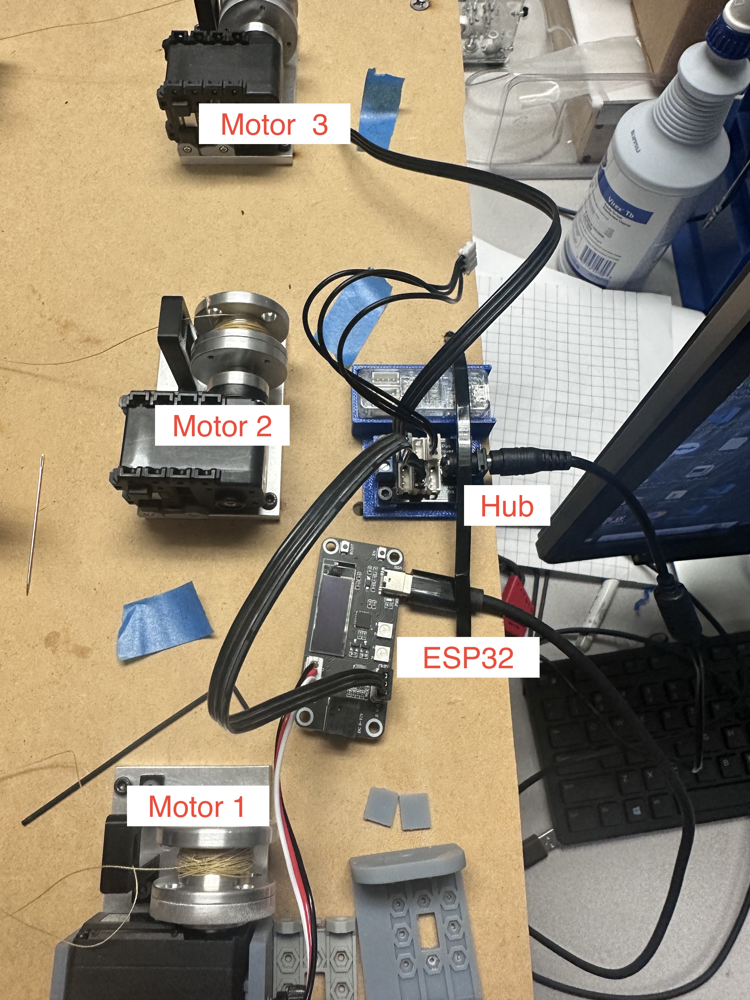
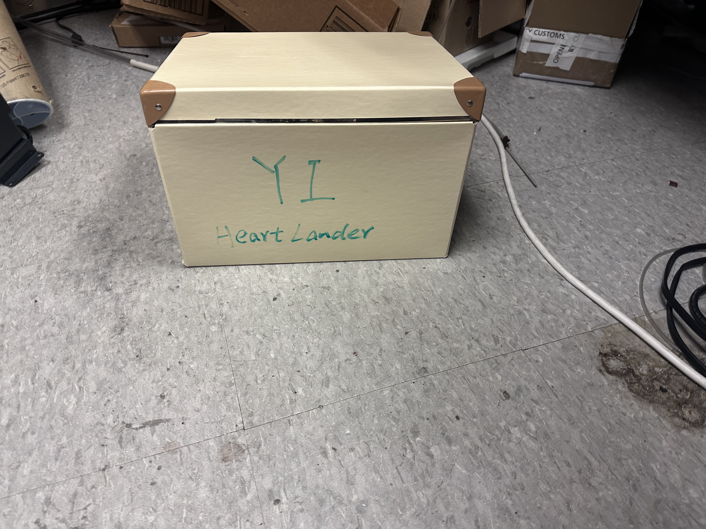

# Heart_Lander_recurrent
## Overview
This repository contains the implementation files for the Heart Lander project, which is a robotic system designed to assist in epicardial interventions. The development and design are based on methodologies detailed in the paper "Development of a Flexible Parallel Wire Robot for Epicardial Interventions". The system utilizes motors and servos for precise control, and adheres to the heart using a new suction base design, as detailed below.

## Setup Instructions
1. Hardware Components
Motors and Servos: The system is driven by a set of motors and servos to control the movement of the robotic arms and suction bases.
New Motor Holder: The design includes a newly developed motor holder, which is located in the design_files directory.
Suction Base: The robot now utilizes a redesigned suction base that provides improved adhesion to the heart. The new suction base design can be found in the design_files folder.
2. Software Components
Arduino Setup: The arduino_files folder contains the necessary Arduino files for setting up and controlling the motors. This includes base functions for motor and servo configuration.
3. Design Files
Motor Holder: CAD files for the new motor holder design.
Suction Base: CAD files for the redesigned suction base. This improved design ensures stable adherence to the heart during operation.
## Steps to Use
Follow the Paper: Detailed steps for setting up and operating the Heart Lander system are based on the paper. Ensure you review the design and setup guidelines carefully.
Hardware Assembly: Assemble the motors, servos, and the new motor holder using the designs provided.
Arduino Configuration: Upload the base Arduino code from the arduino_files folder to configure the motors and servos.
Operate the System: Once the hardware and software are configured, you can begin using the Heart Lander system for epicardial interventions as per the methodology outlined in the paper.
## Code include
- Software:  Calibration and Registration are standalone procedures and the other 3 modules are included in the main loop.
    - Calibration: I implemented 2 versions for calibrating the EM tracker, calibration_setzero.py is for manually set zero at the beginning and calibration_relative.py directly calculate the relative position.
    - Registration: I implemented compute_registration.py to perform 3D point cloud registration. The approach and methods used in this implementation were inspired by concepts borrowed from Aman.
    - Tracking: Cerberus_EM_tracker_ST3215.py  is designed for the process of tracking the position of the injector head through EM tracker and motor actuation.
    - Main Loop: main contains the main loop (including initialization of the devices, calibration, motor control, tracking and recording.
    - Utility Library: The utility functions and libraries are all included in the utils directory.
    - Unit Test: Unit test of motor control and load cell (check the tension in the cable) are implemented in the unit_test
- ESP32 control board:
    - Connect motor to the board: The detailed steps to assemble the motor, the cable, and the ESP32 board, and connect them to the PC, are documented in the ReadME.md of the repo.
    - Control: ESP32_Firmware.ino includes a servo control system using a PID controller that adjusts the servo's position based on input from a potentiometer. The system also includes a serial interface for setting and retrieving the servo's position, with commands for enabling and disabling the system.

## How to connect
Follow the instructions in the figure 

Each motor needs to be connected to an ESP32. Motor 1 has already been replaced. Motor 2 and 3 need to be changed and  connected in the same way in the future.
For how to connect board with motor and how to run basic control function, please follow this link as reference:https://www.waveshare.com/servo-driver-with-esp32.htm

## Accessory
The remaining accessories and new motors/ESP boards are all included in this box.

## Contact
ywang779@jh.edu
